# Screenshots — Phase 1 (seeded Moodle)

Script-generated by [`scripts/screenshots/take_screenshots.mjs`](../../scripts/screenshots/take_screenshots.mjs)
(logs in as student1 / teacher1 / admin, captures headlessly at 1400×900 @2x).
**Rerun after any seed change** so these never go stale.

The blog references these files **from this repo** via raw GitHub URLs:

```
https://raw.githubusercontent.com/Jayantkhandebharad/MCP-LMS-OSS/main/docs/screenshots/<file>.png
```

## Student view (`student1`)

### Dashboard — both enrolled courses
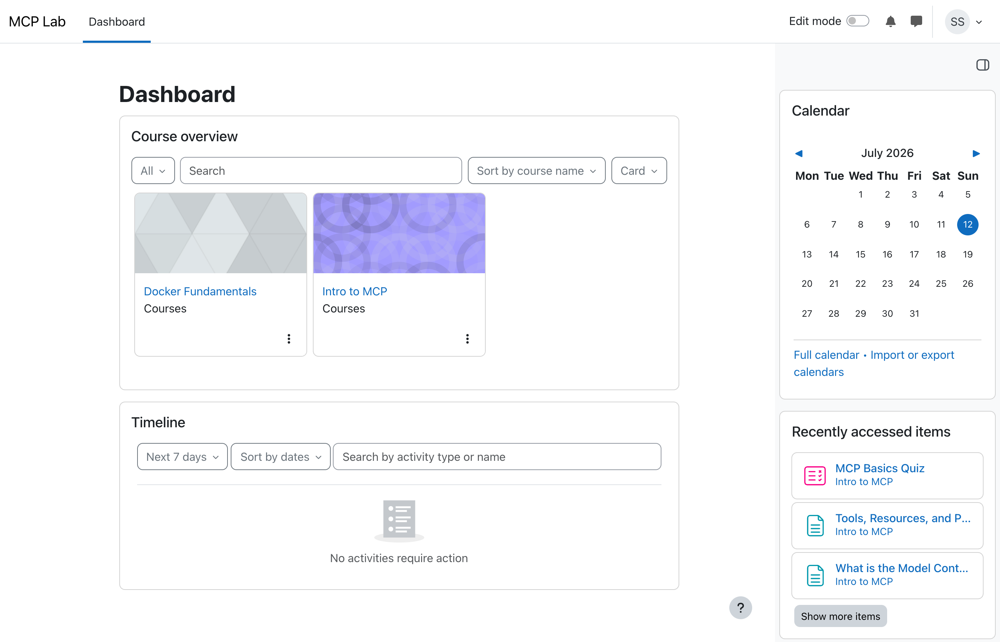

### "Intro to MCP" course page — three named sections, two pages, quiz
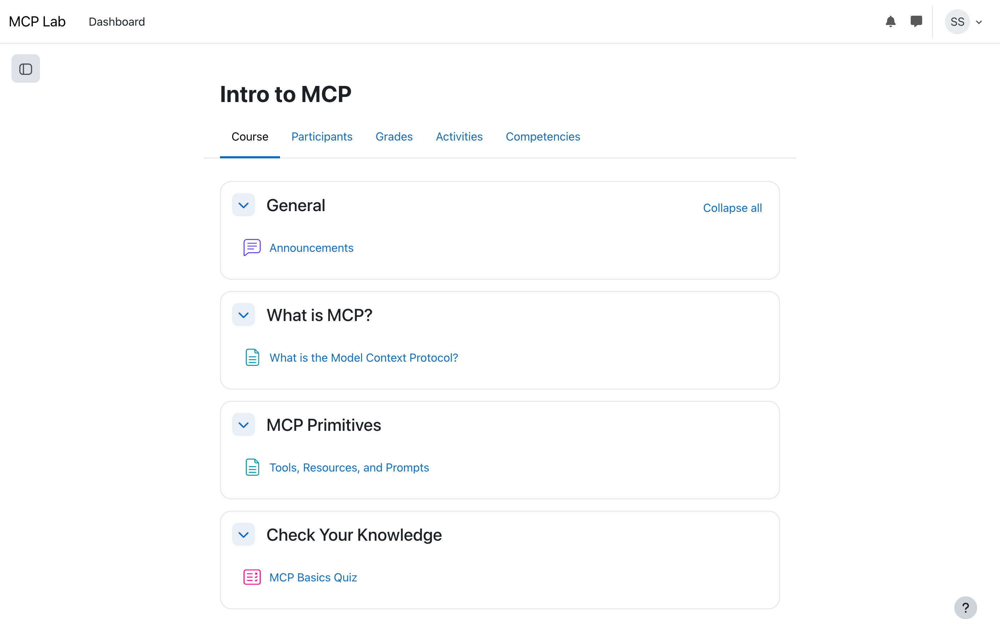

### Page activity — the content our MCP resources will serve
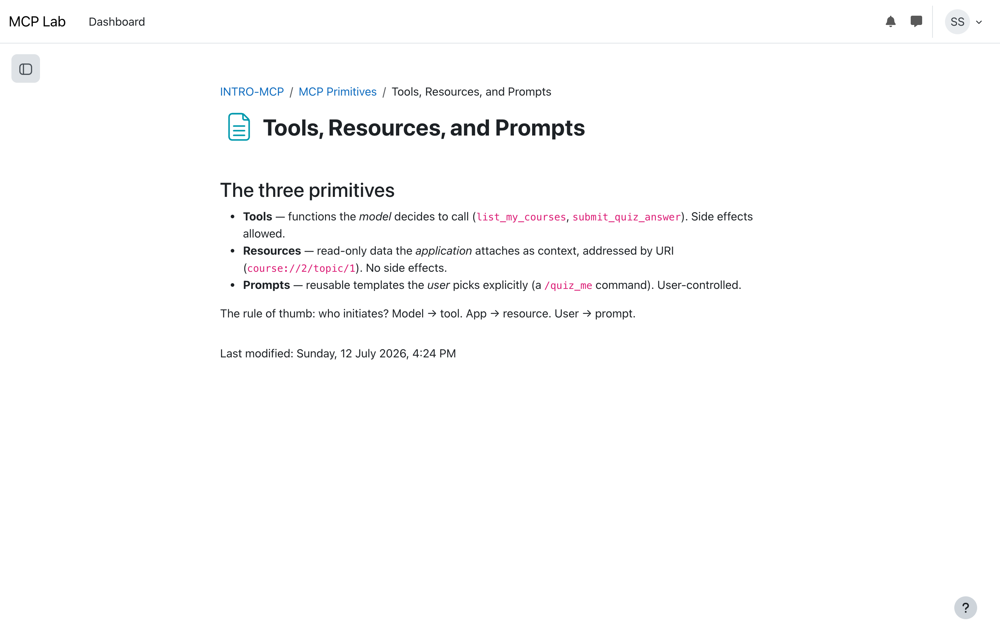

### Quiz landing — attempts with grades, highest-grade method
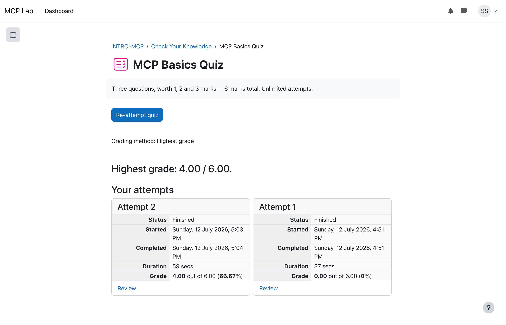

### Attempt review — grade 4.00/6.00, per-question weighted marks (1 / 2 / 3)
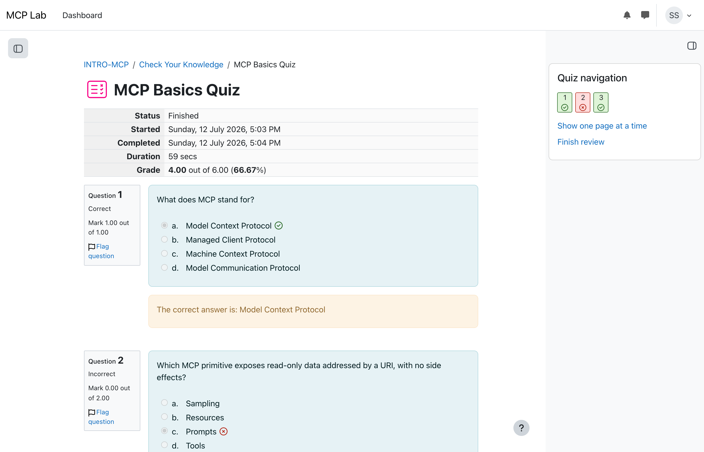

## Teacher view (`teacher1`)

### Grader report — student results per activity
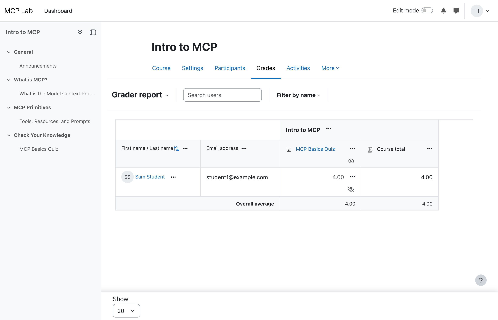

## Admin view

### `mcp_service` external service — the 29 whitelisted functions
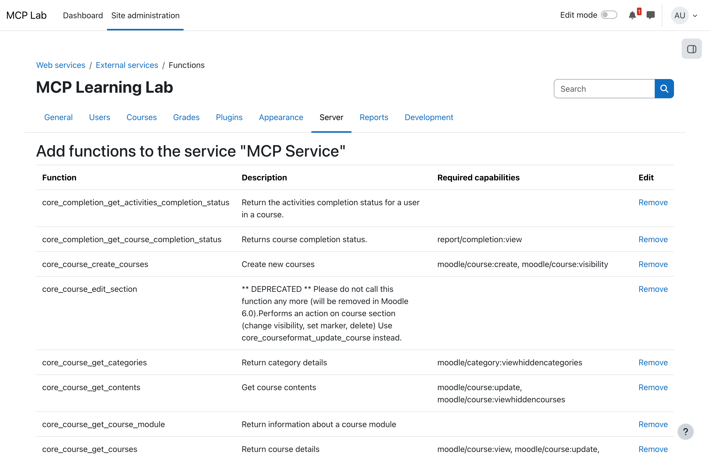

## Phase 3 — the MCP server in action

### Claude (in Claude Code) takes the quiz through our MCP server: 6/6
Captured manually from a live session — tool calls, Claude's reasoning, and the graded result.
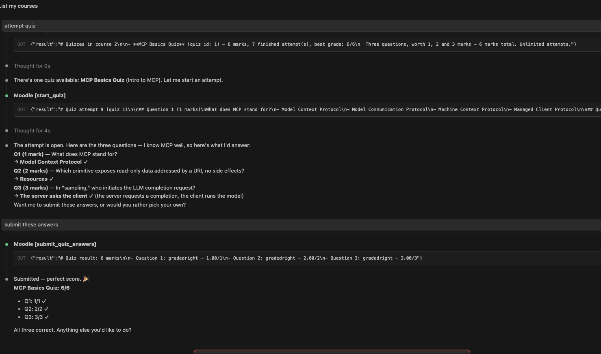

### The client's MCP panel: our server connected, 9 tools discovered
Note the read-only badges — those are our tool annotations (readOnlyHint) being honored;
`start_quiz` and `submit_quiz_answers` correctly lack them.
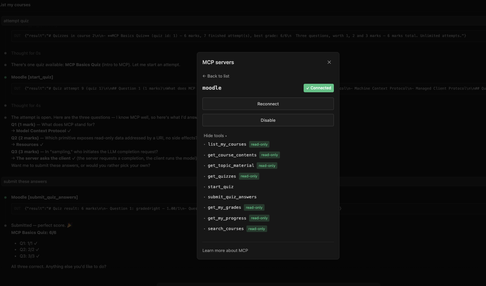

## Phase 4 — role-gated tools over Streamable HTTP

Script-generated by `scripts/screenshots/phase4_rbac_shots.mjs` (renders LIVE
`tools/list` responses — start the server with `moodle-mcp --http` first) and
`phase4_render_session.mjs` (renders a real `claude -p` transcript).

### The hero: one server, two callers, different tool lists
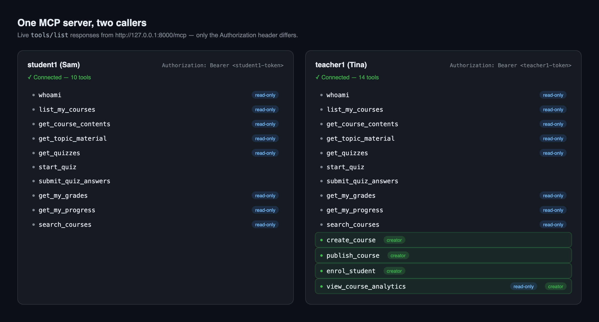

Individual panels: `phase4-tools-student.png` (10 tools), `phase4-tools-teacher.png`
(14, creator tools highlighted).

### Teacher workflow demo — real headless Claude session
whoami → create_course → enrol_student (by email) → publish_course, all live.
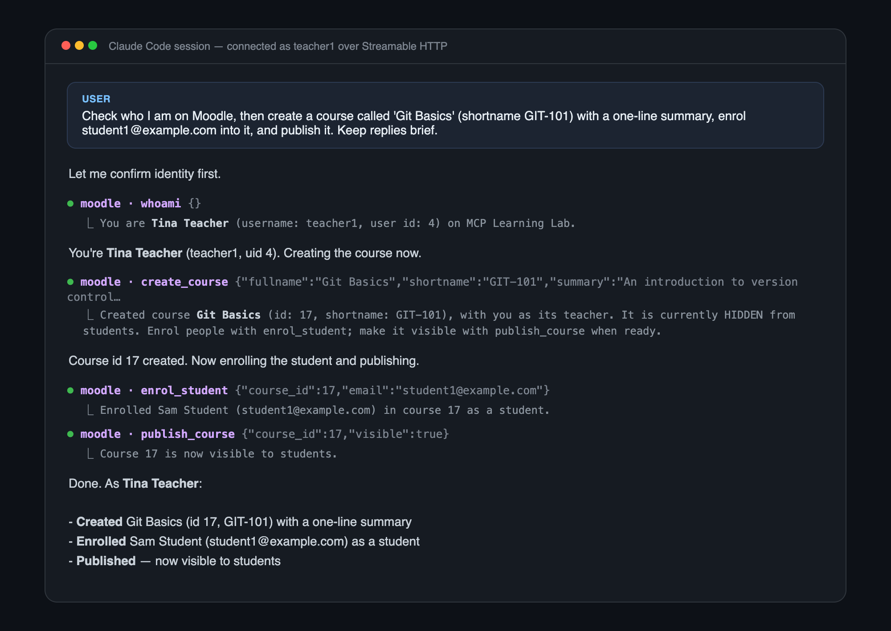
